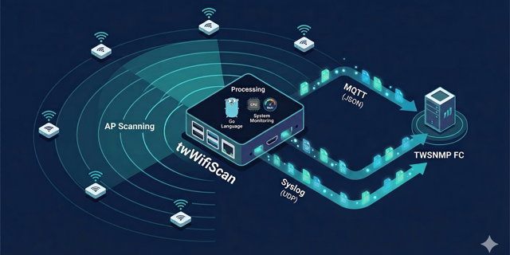

# twWifiScan
Wifi AP sensor for TWSNMP FC

[](http://godoc.org/github.com/twsnmp/twWifiScan)
[](https://goreportcard.com/report/twsnmp/twWifiScan)

[日本語の説明](./README_ja.md)




## Overview

twWifiScan is a sensor program that collects information on wireless LAN access points in the surrounding area and sends it to TWSNMP FC, etc., via syslog or MQTT.

In the current version, the following information can be obtained:

- Statistical information on monitored packets
- Sensor resource usage
- Wireless LAN access point details (BSSID, SSID, RSSI, Channel, Encryption, etc.)


## Status

- v1.0.0 released (2021/9/8): Initial release with basic functions.
- v1.0.1 released (2021/10/31): macOS bug fix.
- v1.1.0 released (2025/1/26): Automatic release.
- v2.0.0 (Current): Integrated MQTT support and removed macOS dependencies.

## Build

Build the project using the `make` command:

```bash
$ make
```

Available targets:

```
  all        Build all executable files (default)
  clean      Delete the built executable files
  zip        Create Zip files for distribution
```

Running `make` creates executable files for Windows, Linux (AMD64), Linux (ARM), and Linux (ARM64) in the `dist` directory.

To create distribution zip files:

```bash
$ make zip
```

## Run

### Usage

```bash
Usage of dist/twWifiScan:
  -debug
    	Enable debug mode
  -iface string
    	Monitor interface (default "wlan0")
  -interval int
    	Send interval (sec) (default 600)
  -mqtt string
    	MQTT broker URL
  -mqttClientID string
    	MQTT client ID (default "twWifiScan")
  -mqttPassword string
    	MQTT password
  -mqttTopic string
    	MQTT topic prefix (default "twWifiScan")
  -mqttUser string
    	MQTT user
  -syslog string
    	Syslog destination list
```

Syslog destinations can be specified as a comma-separated list. You can also specify the port number after a colon.

```bash
-syslog 192.168.1.1,192.168.1.2:5514
```

To start, a monitoring LAN I/F (`-iface`) and a destination (`-syslog` or `-mqtt`) are required.

Example (Linux):

```bash
# ./twWifiScan -iface wlan0 -syslog 192.168.1.1 -mqtt tcp://broker.example.com:1883
```

## Data Format

### Syslog
The transmitted syslog message uses the `local5` facility with the tag `twWifiScan`.

Example (APInfo):
```
type=APInfo,ssid=F660T-VFyM-X,bssid=FC:C8:97:B0:xx:D5,rssi=-73,Channel=1,info=Encrypt;802.11i/WPA2 Version 1,count=9593,change=0,vendor=zte,ft=2024-12-06T15:48:57+09:00,lt=2025-01-26T16:38:57+09:00
```

### MQTT
Messages are published in JSON format to topics based on the `mqttTopic` prefix:
- `<mqttTopic>/APInfo`
- `<mqttTopic>/WifiScanStats`
- `<mqttTopic>/Monitor`

## License

See [LICENSE](./LICENSE).

```
Copyright 2021-2026 Masayuki Yamai
```
